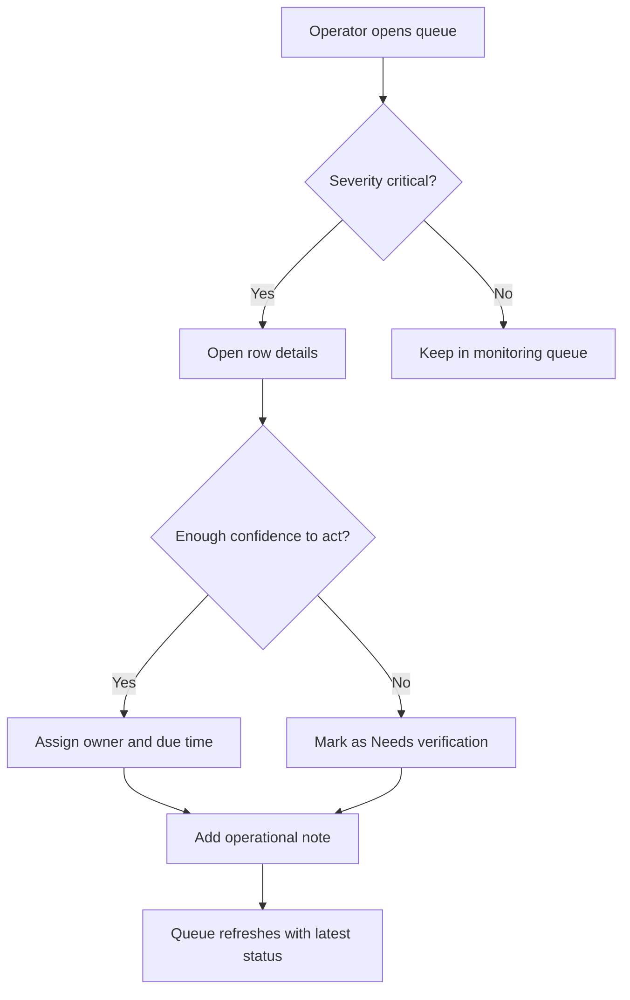

# Inventory Exception Console

## Document Overview

This PRD is intentionally written with a fuller Markdown structure so we can verify the HTML renderer across rich content blocks, not just short paragraphs.

| Field | Value |
| --- | --- |
| Primary user | Operations specialist |
| Secondary user | Inventory manager |
| Main KPI | Time to first action on critical exception |
| Launch scope | Web console only |
| Delivery mode | Incremental rollout behind internal flag |

## Background

The inventory team currently reacts to stock anomalies through a mix of spreadsheets, Slack pings, and delayed internal dashboards. By the time a planner sees an issue, a promotion may already be live, the PDP may already be showing incorrect stock, or customer service may already be handling fallout.

Several teams have asked for one operational surface that combines:

- a prioritized queue
- clear severity logic
- recommended actions
- lightweight assignment and resolution workflows

## Problem

Ops specialists do not have one place to review inventory exceptions, understand why each exception matters, and take the next action quickly. The existing workflow creates three repeated problems:

1. Critical exceptions are mixed with low-priority noise.
2. Ownership is unclear, so issues sit unassigned.
3. Resolution notes live outside the operational surface, which weakens traceability.

> We are not missing raw data. We are missing a fast, trustworthy place to turn that data into action.

## Goals

- Show a prioritized queue of inventory exceptions with severity, status, owner, and freshness.
- Let an operator take the most common next actions without leaving the queue context.
- Reduce the time from exception creation to first owner assignment.
- Preserve an auditable history of why a case was updated.
- Provide a live interactive artifact inside the PRD so design and engineering can align on the exact interaction.

## Non-Goals

- Redesign the forecasting or replenishment algorithms themselves.
- Build a full analytics warehouse replacement.
- Solve vendor communication workflows in this phase.
- Replace all existing operations tooling on day one.

## Users

### Primary User

The primary user is an operations specialist monitoring daily exception queues and making the first triage decision.

### Secondary User

The secondary user is an inventory manager who reviews trends, reassigns blocked work, and approves higher-risk actions.

## Product Principles

- Make urgency obvious without overwhelming the operator.
- Keep the most common actions one click away.
- Preserve context before asking for a decision.
- Prefer structured fields over free-form process memory.

## User Flow

1. The operator lands on the exception console at the start of a shift.
2. The queue defaults to `Critical` and `Needs action` items sorted by freshness.
3. The operator opens one row to inspect affected SKU, channel, and recommended action.
4. The operator either assigns the case, requests verification, or marks a mitigation plan.
5. The system records the update and returns the operator to the queue with the case status refreshed.

### Happy Path

- Operator filters to critical exceptions.
- Operator opens an exception with no owner.
- Operator assigns the case to a regional planner with a due time.
- Operator adds a short operational note.
- Case moves from `Needs action` to `In progress`.

### Recovery Path

- Operator opens a case but does not have enough confidence to assign it.
- Operator marks it as `Needs verification`.
- System keeps the note, requested verifier, and latest timestamp visible in the queue.

### Mermaid Flow Test



## States and Edge Cases

- A row has no owner and is older than SLA threshold.
- The recommended action is unavailable because the downstream service is degraded.
- The same SKU appears in multiple channels with different severities.
- An operator opens the action modal, changes the assignee, then cancels.
- A resolved item reopens because fresh stock data crosses the risk threshold again.

## Scope Breakdown

### In Scope

- Queue list with sorting, status, severity, and assignee
- Row-level action modal with editable form
- Resolution notes and due time capture
- Basic search by SKU, title, or market
- Empty state and no-result state

### Out of Scope

- Bulk actions across dozens of rows
- CSV export
- Approval chain workflows
- External notification routing

## Requirements

- [x] Render a readable queue with multiple columns.
- [x] Keep action controls close to each row.
- [x] Support an inline workflow that opens a form modal in the demo region.
- [x] Preserve local UI state so reviewers can inspect interaction behavior.
- [ ] Connect to real backend data in this prototype.

## Live Demo

The first demo is intentionally interaction-heavy so we can inspect table rendering, actions, modal layering, and form controls inside the preview area.

:::live-demo
id: inventory-exception-queue
source: demos/inventory-exception-queue.jsx
height: 760
theme: fintech-clean
caption: Queue-based exception workflow with row actions, modal editing, and local state updates.
:::

The second demo gives a fuller page context around the same queue pattern.

:::live-page
id: inventory-exception-page
source: demos/inventory-alert-page.jsx
route: /playground/inventory-exception-console
height: 920
theme: fintech-clean
caption: Full-page view of the operations console, including summary metrics and queue context.
:::

The block below is a focused icon component sample for checking icon scale, semantic color, badge pairing, and icon-button rendering inside the HTML preview.

:::live-demo
id: inventory-status-icons
source: demos/inventory-status-icons.jsx
height: 420
theme: fintech-clean
caption: Compact icon-oriented component showcase for PRD rendering review.
:::

The block below is a chart-oriented sample for checking bar-chart and line-chart rendering inside the PRD preview.

:::live-demo
id: inventory-trend-charts
source: demos/inventory-trend-charts.jsx
height: 460
theme: fintech-clean
caption: Native SVG bar and line chart sample for chart-style requirement modules.
:::

## Acceptance Criteria

- Critical cases are visually distinguishable from lower-severity items.
- The operator can open an action flow directly from a row.
- The action modal supports updating owner, status, due time, and notes.
- Saving a change updates the queue state in-place without navigating away.
- Empty and filtered states remain understandable.

## Success Metrics

| Metric | Current baseline | Target |
| --- | --- | --- |
| Median time to first owner assignment | 47 min | under 15 min |
| Critical exception backlog older than 2h | 19% | under 5% |
| Ops handoff messages sent in Slack per day | 38 | under 10 |

## Delivery Notes

### Data contract draft

```json
{
  "id": "INV-2198",
  "severity": "critical",
  "status": "needs_action",
  "sku": "SKU-44821",
  "market": "US",
  "owner": null,
  "recommendedAction": "Pause campaign and verify stock delta",
  "createdAt": "2026-03-29T08:30:00.000Z"
}
```

### Implementation notes

- Prefer optimistic UI updates for assignment and status changes.
- Preserve action history in a structured activity log.
- Treat notes as operational annotations, not customer-facing content.

## Open Questions

- Should managers be able to override severity directly from the queue?
- Do we need a dedicated status for `Waiting on vendor` in v1?
- Which fields must be mandatory before a case can move to `Resolved`?

<!-- live-prd-comments
[
  {
    "id": "comment-1774768643220",
    "quote": "n structure",
    "occurrence": 0,
    "body": "你好22222",
    "status": "resolved",
    "createdAt": "2026-03-29T07:17:23.220Z",
    "updatedAt": "2026-03-29T07:18:41.272Z",
    "resolvedAt": "2026-03-29T07:18:41.272Z"
  }
]
-->
